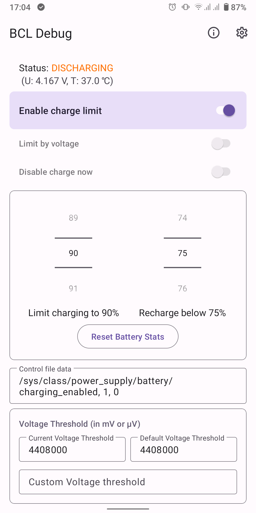
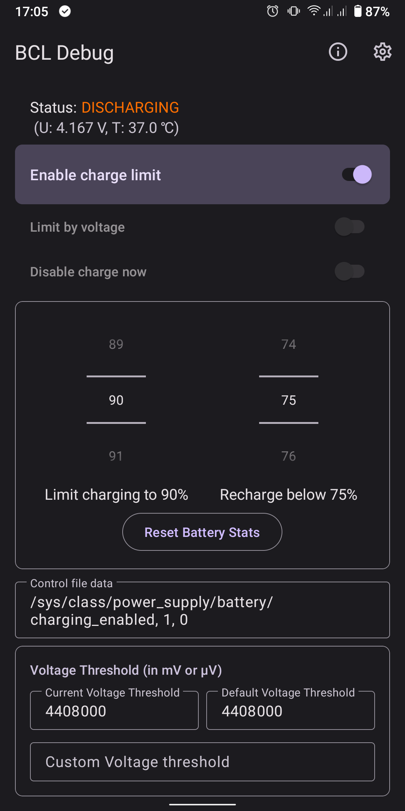
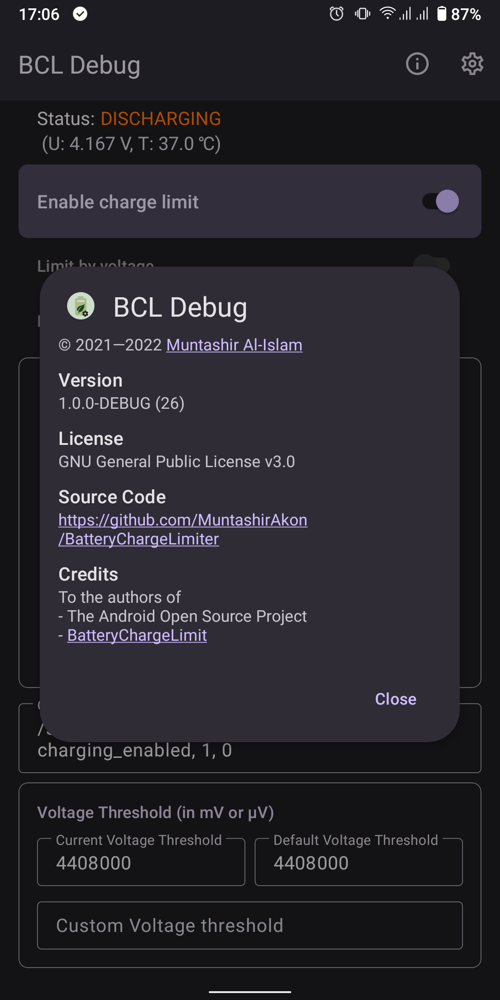

# Battery Charge Limiter (BCL)

A fork of **Battery Charge Limit** whose development has been stalled for some time.

_This app is a work in progress. If a feature is not working, do not hesitate to file a report._

**NOTE:** This is app currently requires root to function. While it is not possible to control charging without root, an alarm-based solution might be implemented for no-root users in the future.

## Features
- Free and open source.
- Material 3 with dynamic colours.
- Control when to start and stop charging — either directly or via an widget.
- Set voltage threshold.
- Set custom battery control configuration if the supplied ones cannot be used properly.

### Same as ACC?
`acc` offers a broad range of features which might be too much for some people.

## Troubleshooting
If BCL cannot start or stop charging correctly, enable **Always Write CTRL File** in the settings.

## Screenshots

## License

GNU General Public License v3.0
